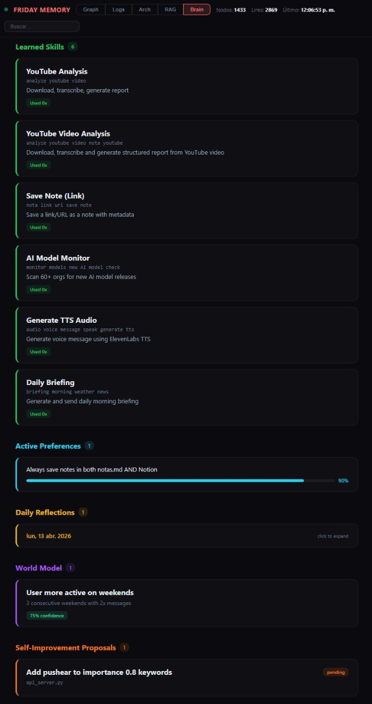

# Friday — A 24/7 AI Assistant Built Entirely on Claude Code

An always-on personal AI system using only Claude Code CLI ($100/month) and Telegram — no custom AI, no cloud VMs, no fine-tuning.

**Live page:** [missingus3r.github.io/friday-showcase](https://missingus3r.github.io/friday-showcase/)

---

## What Is This?

A self-evolving AI assistant that runs 24/7 on a standard Windows, Linux, or macOS machine. It talks over Telegram, runs scheduled tasks, manages files and projects, and keeps persistent memory across sessions — and it **learns from its own behavior**: acquiring skills, reflecting nightly, inferring preferences from repeated corrections, and proposing its own improvements. All powered by **Claude Code** (Anthropic's CLI agent) on the $100/month Max Plan — no custom AI backend, no fine-tuned models, no orchestration framework. The only custom code is a lightweight Flask server for memory and the self-evolving subsystems.

## How It Works

Claude Code sits at the center, reaching external services through MCP (Model Context Protocol) plugins and shell tools. A `CLAUDE.md` file is the system prompt — behavior, tools, and cron schedules. Self-evolving subsystems (skills, reflection, preference learning, world modeling, proposals) run as scheduled jobs on the same memory server, feeding insights back into behavior with no fine-tuning.

```
User (Telegram) ---> Claude Code (with MCP plugins)
    |
    |--> Memory API        ---> SQLite (conversations, memories, embeddings)
    |--> Self-Evolving     ---> Skills, reflections, preferences, world model, proposals
    |--> Knowledge Base    ---> Notes, wiki, structured data (Notion MCP)
    |--> GitHub            ---> Repos (push, commit, PR)
    |--> Voice API         ---> Text-to-speech / Speech-to-text (ElevenLabs)
    |--> Email (MCP)       ---> Send, receive, forward (AgentMail)
    |--> Web Search/Fetch  ---> News, research, data
    |--> Cron system       ---> Recurring autonomous jobs
    |--> Local tools       ---> Shell, scripts, system utilities
```

## Why Not Use an Agent Framework?

Agent frameworks (OpenClaw, NemoClaw, and others) are impressive but add layers: custom runtimes, orchestration code, deployment pipelines, often their own API costs.

Claude Code already *is* the runtime — native tool use, MCP plugins, cron scheduling, sub-agent spawning, file I/O, git, and shell, all built in. No glue code between the LLM and the tools.

> One plan, one CLI, one model: stay within a single subscription, respect the provider's ToS, and let the model do what it was designed to do.


[](https://www.star-history.com/?repos=missingus3r%2Ffriday-showcase&type=date&legend=top-left)

## The Stack

| Component | Technology |
|-----------|-----------|
| Brain | Claude Code CLI (Fable 5.x / Opus 4.x, 1M context) |
| Communication | Telegram MCP plugin |
| Memory | Flask + SQLite + Embeddings (RAG) |
| Knowledge | Notion MCP |
| Voice | ElevenLabs API (TTS/STT) |
| Scheduling | Claude Code built-in cron system |
| Cost | $100/month (Anthropic Max Plan) |

## Screenshots

### Memory Graph

*D3.js force-directed view of conversations, memories, and entities. Drag, zoom, and click to explore.*

### Architecture Diagram

*Map of all components and their connections. Nodes are draggable; positions persist server-side.*

The memory server renders all logs, memories, and entities as interactive graph nodes. This implementation is called **Friday**, but the name is just a variable in the CLAUDE.md configuration.

## Capabilities

- **Scheduled briefings** — weather (Open-Meteo), forex/crypto (DolarAPI, ExchangeRate), AI news (WebSearch), movies (YTS)
- **Autonomous monitoring** — scans 60+ HuggingFace orgs, blogs, and aggregators for new AI model releases
- **Notes & knowledge** — saves links, text, and structured data to Notion (MCP) and local markdown
- **Voice messages** — transcribes audio in (ElevenLabs Scribe STT), replies with synthesized speech (ElevenLabs TTS)
- **Video analysis** — downloads, transcribes (YouTube subs / ElevenLabs), and reports via LLM (Groq / OpenRouter)
- **Email** — check, draft, send, forward (AgentMail MCP)
- **Git** — commit, push, PRs, repo management (GitHub API + git CLI)
- **Web research** — search, fetch, summarize, report back (WebSearch + WebFetch)
- **Self-healing crons** — monitors its own jobs and recreates any that expire
- **Proactive messaging** — reaches out first: check-ins, reminders, follow-ups based on memory and context
- **Skill acquisition** — extracts reusable patterns from solved tasks, stored with trigger patterns
- **Daily self-reflection** — nightly review of logs for mistakes, wins, and patterns → insights
- **Preference learning** — infers rules from repeated corrections and applies them automatically
- **World modeling** — a behavioral model of the user (activity, topics, correlations) with confidence + expiry
- **Self-improvement proposals** — formal proposals with diffs; never applied without approval
- **Memory API health** — periodic checks with auto-restart and failure notification
- **Live camera & object detection** *(optional extra)* — turns a security camera (IP, USB, etc.) into a local detector: YOLOv8n (Ultralytics + OpenCV) detects people on-device, captures a snapshot with a bounding box + a ~10s clip, and alerts via Telegram — nothing leaves the machine. Enabled by the `--with-camera` flag in the setup prompt

## Scheduled Jobs

A handful of autonomous cron jobs keep the system alive and learning. Over time the assistant **consolidated its own schedule** — collapsing 25 sprawling jobs into 8 grouped ones. Exact times are arbitrary, so adapt them to your routine; what matters is the split between the **essential** jobs (the framework itself) and the **project-specific** ones you swap for your own.

**Essential — the framework:**

| Job | Purpose |
|-----|---------|
| Heartbeat + self-heal | Health check, verify every cron is alive and recreate any that expired (7-day TTL), watch for a "deaf" Telegram poller (Bot API up but no local listener) |
| Daily briefing | Weather, currencies, AI news, project changes — sent unprompted |
| Harness daily | Reflection, metrics, goal prioritizer, predictions resolver, memory decay, skill promotion, preference learning, auto-audit |
| Overnight swarm | Parallel sub-agents (productivity, memory, news, improvements) synthesized into one digest |
| Experiments runner | Drive A/B experiments via `/sandbox` dry-runs, auto-conclude when `min_samples` reached |
| Weekly summarization | Compress old conversation logs into summaries without deleting originals |

**Project-specific (examples — swap for your own):** AI-model release monitor, dataset scrapers, monthly usage reports. These aren't part of the core framework — they're whatever *you* want running 24/7.

The heartbeat and briefing crons act as watchdogs — they verify every job is active, recreate missing ones, and refresh them before the 7-day lifetime expires. The dashboard's **Crons tab** shows a two-column diff: runtime jobs with live countdowns vs disk-persisted prompts with sync badges.

### Disaster recovery

`/backup/export` and `/backup/import` move a whole-DB snapshot over HTTP. Schedule a nightly off-site rsync of the export; if the machine dies, import the snapshot into a fresh install, restart, and Friday picks up where it stopped. A **💾 Backup** button on the dashboard does the same from the browser.

## Memory Server

> Reference snapshot: [**github.com/missingus3r/memory-graph**](https://github.com/missingus3r/memory-graph). ⚠️ **Not a template to clone** — that code is generated autonomously by Claude Code following the [SETUP.md](SETUP.md) in this repo, so every user's version differs. The repo is committed only as the source for the screenshots and a reference of what the output looks like.

Claude Code generates a single Flask + SQLite server handling conversation logging, long-term memory, entity tracking, key-value storage, and RAG with vector embeddings. No external vector DB — embeddings live as BLOBs in the same SQLite file.

**Core features:**
- **Conversation logging** — every message with timestamp, role, channel, and auto-classified importance (0.0-1.0)
- **Importance scoring** — auto-classified at insert via dynamic keyword-score pairs in the DB (not hardcoded), editable through `GET/POST /keywords` with hit counts tracked; the preference cron tunes scores over time
- **Semantic search** — cosine similarity over 3072-dim embeddings
- **Hybrid search** — FTS5 + semantic via Reciprocal Rank Fusion, weighted by importance
- **Weekly summarization** — compresses old logs into summaries (originals preserved)
- **Entity tracking** — people, companies, tools, concepts
- **Key-value store** — server-side UI state

**Web visualization** — a single-page app at `/graph` with four tabs:
- **Graph** — D3.js force-directed nodes for conversations, memories, and entities
- **Logs** — chronological view with collapsible date groups and search
- **Architecture** — system diagram with draggable, server-persisted nodes
- **RAG** — semantic-search dashboard with hybrid search and embedding stats

> The whole memory layer is one Python file. No vector DB, no Redis, no Elasticsearch — just Flask + SQLite + embeddings in the same file.

## Self-Evolving Harness

The assistant doesn't just follow instructions — it learns from its own behavior and improves over time. On top of the base assistant sits a thin, entirely additive **cognition harness** that turns Friday from "an LLM with tools" into a system that sets goals, plans, verifies, experiments, and measures whether it's actually improving. (In the spirit of [*When AI builds itself* — Anthropic](https://www.anthropic.com/institute/recursive-self-improvement).)

Five subsystems do the learning:

- **Skill Acquisition** — extracts the pattern from a solved task and saves it as a reusable skill with trigger patterns and steps; usage is tracked.
- **Daily Self-Reflection** — a nightly cron reviews the day's logs (what went well, what went wrong, what patterns emerge) and stores conclusions that feed future behavior.
- **Preference Learning** — periodically analyzes all past feedback; repeated corrections become rules applied automatically.
- **World Model** — builds a model of the user over time (active hours, recurring topics, correlations) with confidence scores and expiration dates.
- **Self-Improvement Proposals** — proposes better keyword lists, cron schedules, or scoring functions as formal diffs; never applied without Telegram approval.

It all runs on the same memory server, visible in the Memory Graph's **Brain** tab — skills, preferences, reflections, world-model insights, and pending proposals.

### Brain Dashboard

*The Brain tab: skills, preferences, reflections, world-model insights, and pending proposals — all on the same memory server.*

**What the harness adds:** 13 SQLite tables, dozens of endpoints (including `/backup/*` for disaster recovery and `/harness/health` for loop monitoring), the harness cron passes, and operational rules in `CLAUDE.md`. Nothing was removed — new columns are `ALTER TABLE … IF NOT EXISTS`, so old DBs upgrade in place. Later passes closed the loops end-to-end: auto-calibration, self-applying proposals with rollback, sandbox auto-promotion, and hybrid recall.

**8 subsystems:**

| Subsystem | Purpose |
|-----------|---------|
| **Goal engine** | Persistent goals with utility, deadline, constraints, success criteria, subgoals, progress. `/goal/next` ranks by `utility × urgency × (1 − progress)`. |
| **Hierarchical planner** | Plan trees: goal → sub-goal → action → tool → expected result → exit condition → rollback. Stored as executable structures, not text. |
| **Three-layer memory** | Episodic (what happened), semantic (stable facts), procedural (skills). Every row carries `provenance`, `confidence`, `last_verified`. Weekly decay cron. |
| **Causal world model** | `wm_entities` (state), `wm_relations` (subject-predicate-object), `wm_events` (with causes/effects), `wm_predictions` (testable claims with calibration gap). |
| **Self-knowledge & autonomy** | `capabilities` with Bayesian-calibrated confidence + 6-rung autonomy ladder (L0 suggest → L5 self-modify with rollback). Gate: `/autonomy/check`. |
| **Verifier & sandbox** | Explicit `factual / consistency / goal_alignment / hallucination / uncertainty / evidence` checks. Dry-run / simulation / live execution modes. |
| **Experiments & skill compiler** | A/B variants with min-delta & min-samples guardrails. Skills gain maturity (draft → beta → stable → deprecated) with promotion rules. |
| **Metrics** | 11 KPI catalog: `hallucination_rate`, `calibration_gap`, `goals_completed_per_week`, `skill_success_rate`, etc. Daily cron records them. |

**Consolidated Brain dashboard** — eight sections (Overview, Goals, Memory, World, Self, Safety, Learning, Metrics) behind a sticky sub-nav. **Crons dashboard** — runtime snapshot with live countdowns + disk-persisted prompts with sync badges.

> The system gets better every day not because the model changes, but because it builds a growing library of skills, preferences, and patterns on top of it. The model stays the same; the assistant evolves.

> **Golden rule (in `CLAUDE.md`):** no unrecorded autonomy. Every goal, plan node, sandboxed action, resolved prediction, and promoted skill leaves a row — the dashboards are where a human audits whether the system is earning its autonomy.

## The $100 Question

The whole system runs on a single **$100/month Anthropic Max Plan**. No cloud inference VMs, no LangChain/AutoGPT/agent framework — just Claude Code on a machine with MCP plugins.

> Claude Code isn't only a coding assistant — it's a general-purpose autonomous agent runtime. Give it tools, instructions, and a schedule and it becomes a full 24/7 assistant. One $100 plan buys (almost) unlimited access to a top model with native tool use and long context. That's enough.

## Set It Up Yourself

Download [SETUP.md](SETUP.md) and hand it to a fresh Claude Code session — it walks through every step autonomously (Telegram config, memory server, API keys, CLAUDE.md). You just approve as it goes.

Open Claude Code and type:

```
Read the file ~/Downloads/SETUP.md and follow every step in it to set up a 24/7 AI assistant on this machine. Ask me for confirmation before each major step.
```

Once set up, start it with:

```bash
claude --channels plugin:telegram@claude-plugins-official --dangerously-skip-permissions
```

Claude Code reads your CLAUDE.md, connects to Telegram, creates the cron jobs, and runs autonomously.

---

*Named after the last A.I. assistant Tony Stark built before hanging up the suit. This one doesn't have a suit either — just a terminal.*

**GitHub:** [missingus3r](https://github.com/missingus3r) | **X:** [missingus3r](https://x.com/missingus3r)
