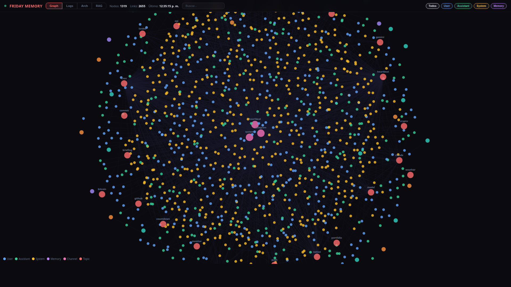
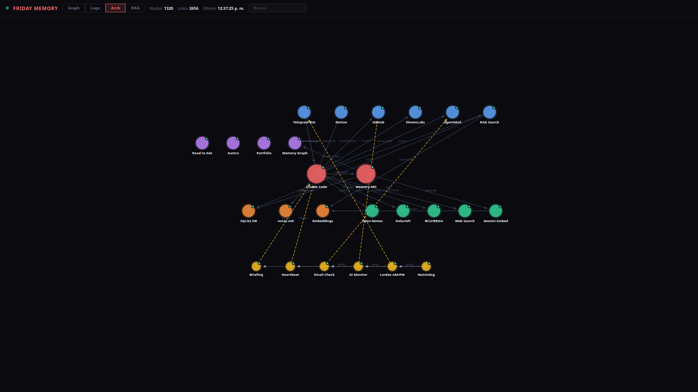

# Friday — A 24/7 AI Assistant Built Entirely on Claude Code

An always-on personal AI system using only Claude Code CLI ($100/month) and Telegram — no custom AI, no cloud VMs, no fine-tuning.

**Live page:** [missingus3r.github.io/friday-showcase](https://missingus3r.github.io/friday-showcase/)

---

## What Is This?

This is a personal AI assistant that runs 24/7 on a standard Windows, Linux, or macOS machine. It communicates via Telegram, runs scheduled tasks autonomously, manages files and projects, and maintains persistent memory across sessions. The entire system is powered by **Claude Code** (Anthropic's CLI agent) on the $100/month Max Plan — no custom AI backend, no fine-tuned models, no orchestration framework. The only custom code is a lightweight Flask server for persistent memory storage.

## How It Works

Claude Code sits at the center, connecting to external services through MCP (Model Context Protocol) plugins and shell tools. A `CLAUDE.md` file acts as the system prompt, defining behavior, available tools, and cron schedules.

```
User (Telegram) ---> Claude Code (with MCP plugins)
    |
    |--> Memory API        ---> SQLite (conversations, memories, embeddings)
    |--> Knowledge Base    ---> Notes, wiki, structured data (Notion MCP)
    |--> GitHub            ---> Repos (push, commit, PR)
    |--> Voice API         ---> Text-to-speech / Speech-to-text (ElevenLabs)
    |--> Email (MCP)       ---> Send, receive, forward (AgentMail)
    |--> Web Search/Fetch  ---> News, research, data
    |--> Cron system       ---> Recurring autonomous jobs
    |--> Local tools       ---> Shell, scripts, system utilities
```

## Why Not Use an Agent Framework?

Projects like OpenClaw, NemoClaw, and other agent frameworks are impressive, but they add layers of complexity: custom runtimes, orchestration code, deployment pipelines, and often their own API costs.

Claude Code already *is* the runtime. It has native tool use, MCP plugin support, cron scheduling, sub-agent spawning, file I/O, git, and shell access built in. There is no glue code between the LLM and the tools — Claude Code handles it all natively.

> The philosophy: stay within a single subscription, respect the provider's Terms of Service, and avoid bolting on external LLM APIs or custom agent infrastructure. One plan, one CLI, one model — and let the model do what it was designed to do.

## The Stack

| Component | Technology |
|-----------|-----------|
| Brain | Claude Code CLI (Opus 4.6, 1M context) |
| Communication | Telegram MCP plugin |
| Memory | Flask + SQLite + Embeddings (RAG) |
| Knowledge | Notion MCP |
| Voice | ElevenLabs API (TTS/STT) |
| Scheduling | Claude Code built-in cron system |
| Cost | $100/month (Anthropic Max Plan) |

## Screenshots

### Memory Graph

*D3.js force-directed visualization of conversations, memories, and entities. Each node type has a distinct color. Drag, zoom, and click to explore.*

### Architecture Diagram

*Visual map of all system components and their connections. Nodes are draggable and positions persist server-side.*

The memory server includes a visual web endpoint that renders all stored logs, memories, and entities as interactive graph nodes. This implementation is called **Friday**, but the system can be renamed to anything — the name is just a variable in the CLAUDE.md configuration.

## Capabilities

- **Scheduled briefings** — weather (Open-Meteo API), forex/crypto (DolarAPI, ExchangeRate), AI news (WebSearch), movies (YTS API)
- **Autonomous monitoring** — scan 60+ orgs on HuggingFace API, blogs, and aggregators for new AI model releases
- **Note-taking and knowledge management** — save links, text, and structured data to Notion (MCP) and local markdown
- **Voice messages** — receive and transcribe audio (ElevenLabs Scribe STT), respond with synthesized speech (ElevenLabs TTS)
- **Video analysis** — download, transcribe (YouTube subs / ElevenLabs), and generate structured reports via LLM (Groq / OpenRouter API)
- **Email handling** — check, draft, send, and forward emails (AgentMail MCP)
- **Git operations** — commit, push, create PRs, manage repositories (GitHub API + git CLI)
- **Web research** — search, fetch, summarize, and report back (WebSearch + WebFetch tools)
- **Self-healing crons** — monitors its own scheduled jobs and recreates any that expire (CronCreate/CronList built-in)
- **Proactive messaging** — the assistant reaches out first: casual check-ins, reminders for things you mentioned and forgot, follow-ups on pending tasks. Not just reactive — it initiates conversations based on memory and context

## RAG & Memory

Every conversation turn is stored in SQLite and embedded using a vector model. When context is needed, the system runs hybrid search combining cosine similarity over embeddings with FTS5 keyword matching, ranked via Reciprocal Rank Fusion. This means the assistant can recall relevant past conversations without needing them in the active context window.

> Embeddings are generated automatically on every new message and memory. The vector index lives in the same SQLite database — no external vector DB needed.

## The $100 Question

This entire system runs on a single **$100/month Anthropic Max Plan**. No cloud VMs running inference. No LangChain, no AutoGPT, no agent framework. Just Claude Code on a machine with MCP plugins.

> The key insight: Claude Code is not just a coding assistant — it is a general-purpose autonomous agent runtime. Give it tools, instructions, and a schedule, and it becomes a full 24/7 assistant. The $100 plan provides (almost) unlimited access to one of the most capable AI models available, with native tool use and long context. That is enough.

## Set It Up Yourself

Download the [SETUP.md](SETUP.md) file and pass it to a fresh Claude Code session. It will walk through every step autonomously — creating the Telegram bot config, memory server, API keys, and CLAUDE.md. You just approve and follow along.

Open Claude Code and type:

```
Read the file ~/Downloads/SETUP.md and follow every step in it to set up a 24/7 AI assistant on this machine. Ask me for confirmation before each major step.
```

That's it. Claude Code reads the guide and walks you through the entire setup autonomously.

Once everything is set up, start the assistant with:

```bash
claude --channels plugin:telegram@claude-plugins-official --dangerously-skip-permissions
```

That's it. Claude Code reads your CLAUDE.md, connects to Telegram, creates all cron jobs, and starts running autonomously.

---

*Named after the last A.I. assistant Tony Stark built before hanging up the suit. This one doesn't have a suit either — just a terminal.*

**GitHub:** [missingus3r](https://github.com/missingus3r) | **X:** [missingus3r](https://x.com/missingus3r)

---


[](https://www.star-history.com/?repos=missingus3r%2Ffriday-showcase&type=date&legend=top-left)
